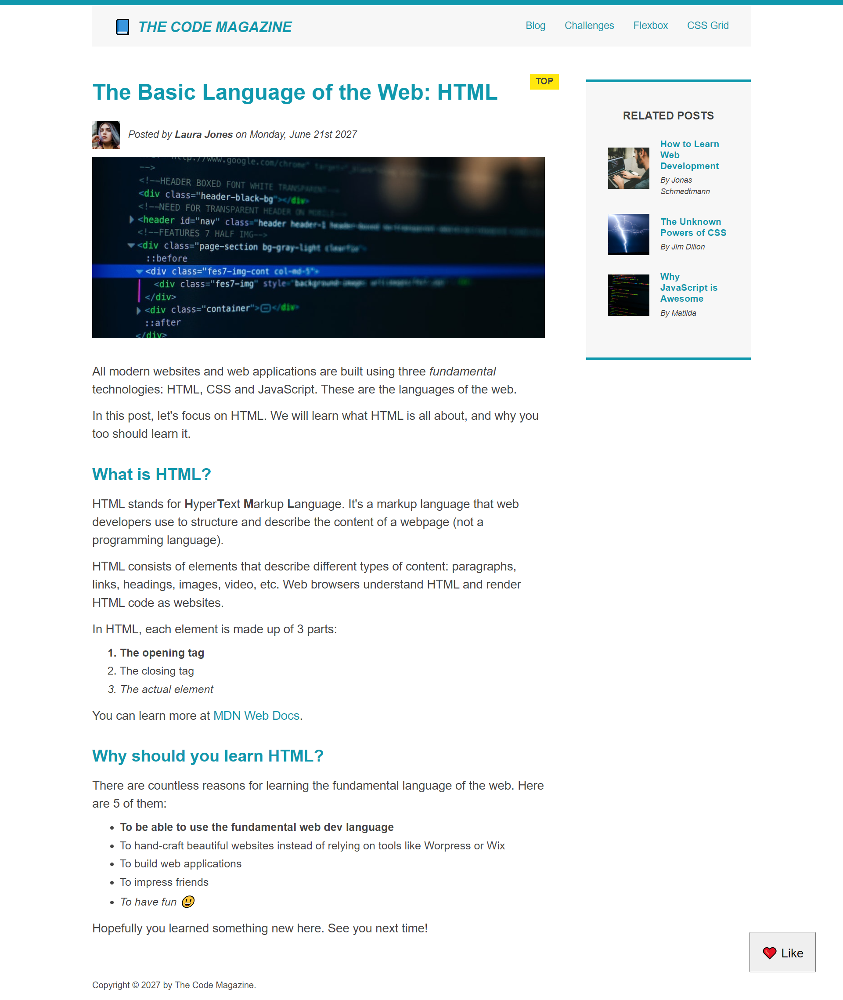

# The Code Magazine Blog

Design and development of a blog page using CSS Layout techniques

# The Code Magazine Blog Page with CSS Grid and Flexbox

This is a blog page made as a challenge in Jonas Schmedtmann Udemy Course.

## Table of contents

- [Overview](#overview)
  - [The challenge](#the-challenge)
  - [Screenshot](#screenshot)
- [My process](#my-process)
  - [Built with](#built-with)
  - [What I learned](#what-i-learned)
  - [Continued development](#continued-development)
- [Author](#author)

**Note: Delete this note and update the table of contents based on what sections you keep.**

## Overview

### The challenge

Users should be able to:

- View the optimal layout depending on their device's screen size
- See hover states for interactive elements

### Screenshot

## My process

### Built with

- Semantic HTML5 markup
- CSS custom properties
- Flexbox
- CSS Grid
- Desktop-first workflow

### Continued development

I will like to continue learnig on layout patterns, and Javascript.

## Author

- Jonas (Build Responsive Real world website course)
- Twitter - [@Raphokafor_](https://www.twitter.com/Raphokafor_)
